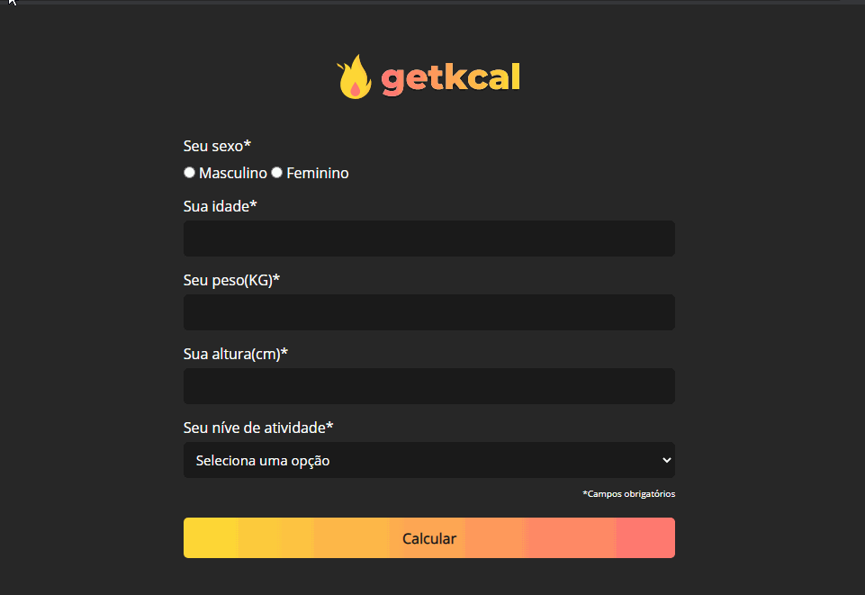

<h1 align="center">
    
<h1>

<h1>
    
    <h3 align="center"> 
        Access the application here 👉 <a href="https://willian-souza.github.io/getkcal/" target="_blank">GetKcal<a>
    <h3>
<h1>

<h1 align = "center">
    <a href="https://www.linkedin.com/in/willian-ssouza/">
        
    </a>
    <a href="https://github.com/willian-souza/rocketseat-site/blob/master/LICENSE">
        
    </a>    
    <a href="https://frontend.code-inspector.com/public/project/9410/getkcal/dashboard">
        
    </a>
<h1>


# 📋 Index
- [About](#-about)
- [Technologies used](#-technologies-used)
- [Download and run the project ](#-download-and-run-the-project)
- [License](#-license)

---

# 📄 About
The GetKcal project is a web application that consists of a calorie calculator, which, according to the data provided by the user, returns the basal metabolism rate and the amount of calories that the user must consume daily if he wants to maintain, lose or gain weight. The fields are all treated, where it is not possible to leave any field blank, and also for the age, weight and height fields it is not possible to enter a negative value or an exorbitant value (Ex: Age 200 years), if it happens it is displayed an alert to the user.

It was inspired in the [application](https://www.youtube.com/watch?v=yiDq9wUiUjc) developed by [Mateus Silva](https://www.linkedin.com/in/mateusilva/).

---

# 🖥 Technologies used
- [HTML5](https://developer.mozilla.org/pt-BR/docs/Web/HTML/HTML5)
- [CSS3](https://developer.mozilla.org/pt-BR/docs/Archive/CSS3)
- [JavaScript](https://developer.mozilla.org/pt-BR/docs/Aprender/JavaScript)

---

# 📦 Download and run the project

Note: To perform the procedures below on your terminal it is necessary to have [Git](https://git-scm.com/downloads) installed on the your machine.

```bash

    # Clone the repository
    $ git clone https://github.com/willian-souza/getkcal

    # Enter the downloaded directory
    $ cd getkcal

    # Run the application
    Open the index.html file in any browser

```
---

# 📝 License
This project is under license MIT. See the archive [LICENSE](/LICENSE) for more details.

---

Developed by [Willian dos Santos Souza](https://www.linkedin.com/in/willian-ssouza/)

